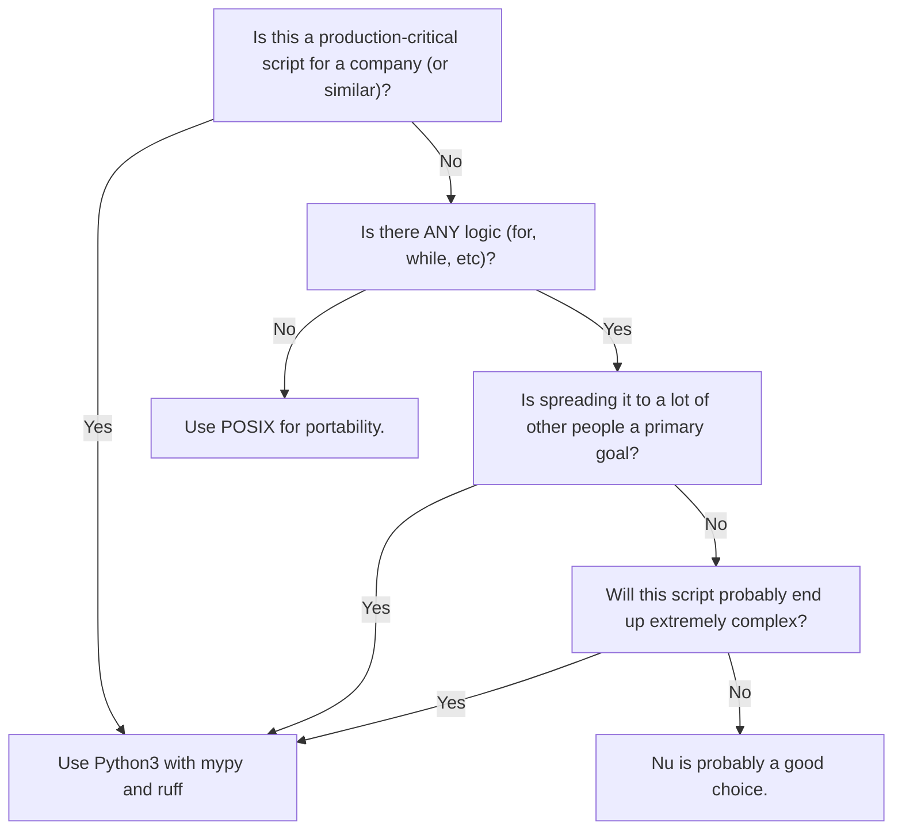

```mermaid
flowchart TD
  reliable["Is this a production-critical script for a company (or similar)?"] -- Yes --> python["Use Python3 with mypy and ruff"]
  reliable -- No --> logic
  logic["Is there ANY logic (for, while, etc)?"] -- No --> posix["Use POSIX for portability."]
  logic -- Yes --> others["Is spreading it to a lot of other people a primary goal?"]
  others -- Yes --> python
  others -- No --> complex["Will this script probably end up extremely complex?"]
  complex -- Yes --> python
  complex -- No --> nu["Nu is probably a good choice."]
```
